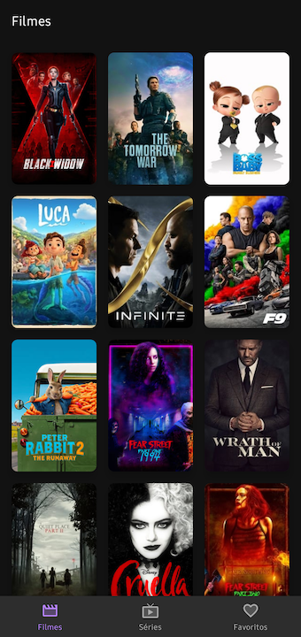

# Playmovie

[](https://github.com/jonathanarodr/playmovie/actions/workflows/android.yml)
[](https://ktlint.github.io/)
[](https://codecov.io/gh/jonathanarodr/playmovie)
[](https://codebeat.co/projects/github-com-jonathanarodr-playmovie-master)
[](https://codeclimate.com/github/jonathanarodr/playmovie/maintainability)
[](https://www.codacy.com/manual/jonathanarodr/playmovie?utm_source=github.com&amp;utm_medium=referral&amp;utm_content=jonathanarodr/playmovie&amp;utm_campaign=Badge_Grade)

## About

Este projeto foi desenvolvido com intuito de aplicar meus conhecimentos em relação ao desenvolvimento Android e padrões de projeto.

## Overview

Playmovie utiliza como fonte de dados a API [api.themoviedb.org](https://api.themoviedb.org) para exibição de filmes e séries mais populares na atualidade.

## Getting Started

Acesse a sessão de API disponível no [thememoviedb](https://www.themoviedb.org/settings/api) e copie o token de leitura da API **(v4 auth)**.

Após captura do token, acesse o arquivo `build.gradle` e configure a propriedade `AUTHORIZATION_KEY` informando sua chave de autorização:
  
```groovy
buildConfigField("String", "AUTHORIZATION_KEY", '"abc1.def2.ghi3"')
```

> Para utilizar a API do thememoviedb, é necessário obter a chave de acesso *free* para desenvolvedores. Veja mais informações na [documentação themoviedb](https://developers.themoviedb.org/3/getting-started/introduction)

## Screenshots




## Libraries

## Credits

* [Thememoviedb](https://www.themoviedb.org/): fonte de dados sobre os filmes
* [Google Fonts](https://fonts.google.com/icons): iconografia do app
