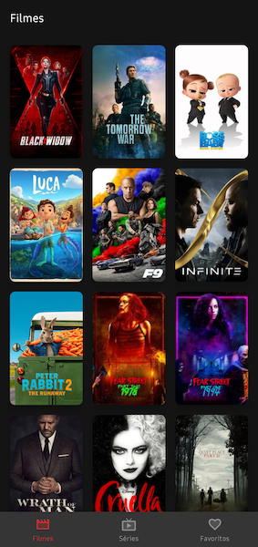
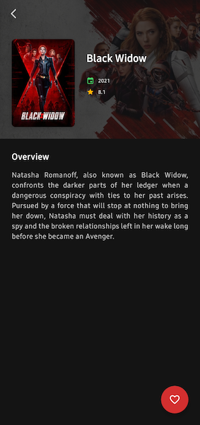

# Playmovie

[](https://github.com/jonathanarodr/playmovie/actions/workflows/main.yml)
[](https://github.com/jonathanarodr/playmovie/actions/workflows/a11y.yml)
[](https://github.com/jonathanarodr/playmovie/actions/workflows/github-code-scanning/codeql)
[](https://github.com/jonathanarodr/playmovie/actions/workflows/pages/pages-build-deployment)

## About

Este projeto foi desenvolvido com intuito de aplicar meus conhecimentos em relação ao desenvolvimento Android e padrões de projeto.

## Overview

Playmovie utiliza como fonte de dados a API [api.themoviedb.org](https://api.themoviedb.org) para exibição de filmes e séries mais populares na atualidade.

## Getting Started

Acesse a sessão de API disponível no [thememoviedb](https://www.themoviedb.org/settings/api) e copie o token de leitura da API **(v4 auth)**.

Após captura do token, acesse o arquivo `build.gradle.kts` do módulo `:network` e configure a propriedade `AUTHORIZATION_KEY` informando sua chave de autorização:
  
```kotlin
buildConfigField("String", "AUTHORIZATION_KEY", "abc1.def2.ghi3")
```

> [!IMPORTANT]
> Para utilizar a API do thememoviedb, é necessário obter a chave de acesso *free* para
> desenvolvedores. Veja mais informações
> na [documentação themoviedb](https://developers.themoviedb.org/3/getting-started/introduction)

## Screenshots




## Running coverage

```bash
./gradlew koverHtmlReportDebug
```

## Libraries

// TODO

## Credits

* [Thememoviedb](https://www.themoviedb.org/): fonte de dados sobre os filmes
* [Google Fonts](https://fonts.google.com/icons): iconografia do app
