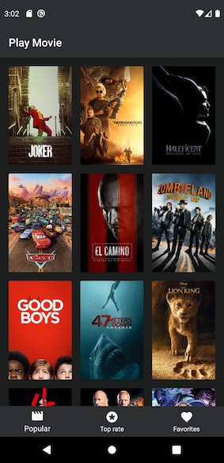
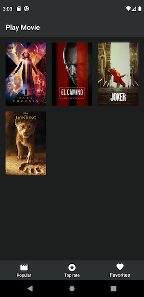
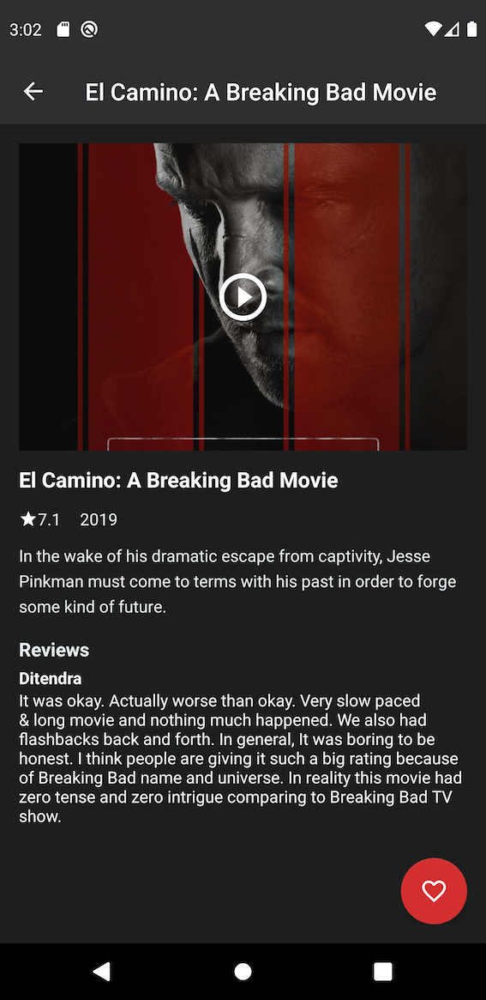

[](https://travis-ci.com/jonathanarodr/playmovie)
[](https://circleci.com/gh/jonathanarodr/playmovie/tree/master)
[](https://codecov.io/gh/jonathanarodr/playmovie)
[](https://codebeat.co/projects/github-com-jonathanarodr-playmovie-master)
[](https://codeclimate.com/github/jonathanarodr/playmovie/maintainability)
[](https://www.codacy.com/manual/jonathanarodr/playmovie?utm_source=github.com&amp;utm_medium=referral&amp;utm_content=jonathanarodr/playmovie&amp;utm_campaign=Badge_Grade)
[](https://ktlint.github.io/)

# playmovie

Para configurar a chave de consulta da [API](https://www.themoviedb.org/), acesse o arquivo `build.gradle` e informe sua chave no field **API_KEY**

```java
...
//exemplo de configuração da API KEY:
buildConfigField("String" , "API_KEY", '"1234567890"')
...
```

## Screenshots




